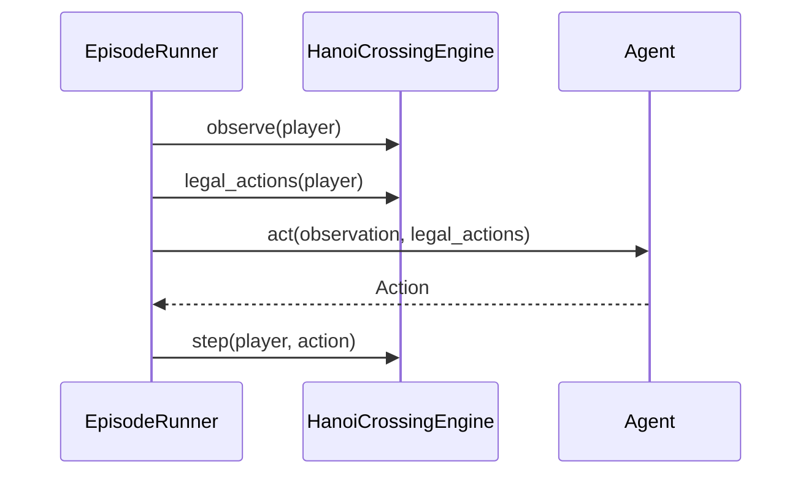

# Hanoi Crossing — Design Document

This document describes the architecture, design patterns, and semantic decisions
for the Hanoi Crossing game engine and its frontends.

## 1. Goals

- **Correct rules engine** for a two-player, partial-information Tower of Hanoi
  variant with a shared middle pole.
- **Reusable core** suitable for RL training loops and online simulation services
  without modification.
- **Thin frontends** (replay CLI, random-play CLI) that consume the same APIs an
  external agent would.
- **Eval integrity** — information boundaries and win detection must be
  structural, not conventional.

## 2. Architecture overview

The codebase is organized in layers with a single direction of dependency:

```
┌─────────────────────────────────────────────────────────┐
│  CLI (replay.py, random_play.py)                        │
│  — argument parsing, I/O, wiring                        │
└──────────────────────────┬──────────────────────────────┘
                           │
┌──────────────────────────▼──────────────────────────────┐
│  EpisodeRunner (runner.py)                              │
│  — episode loop, traces, replay validation              │
└──────────┬─────────────────────────────┬────────────────┘
           │                             │
┌──────────▼──────────┐       ┌──────────▼──────────┐
│  Agents (agents.py)   │       │  Formatting         │
│  — policy interface   │       │  (formatting.py)    │
└──────────┬──────────┘       │  — replay I/O, JSON │
           │                    └─────────────────────┘
┌──────────▼──────────────────────────────────────────┐
│  HanoiCrossingEngine (engine.py)                    │
│  — rules, stepping, observations                      │
└──────────┬──────────────────────────────────────────┘
           │
┌──────────▼──────────────────────────────────────────┐
│  actions.py  │  models.py                            │
│  — Action    │  — BoardState, Observation, traces    │
└─────────────────────────────────────────────────────┘
```

### Layer responsibilities

| Layer | Module(s) | Responsibility |
|-------|-----------|----------------|
| **Types** | `actions.py`, `models.py` | Immutable value objects; no game logic |
| **Engine** | `engine.py` | Authoritative rules and state transitions |
| **Agents** | `agents.py` | Policy interface + reference implementations |
| **Orchestration** | `runner.py` | Turn loop, eval traces, replay validation |
| **I/O** | `formatting.py` | Serialization, replay parsing, human output |
| **Frontends** | `cli/replay.py`, `cli/random_play.py` | User-facing entry points |

## 3. Design patterns

### 3.1 Environment core (Gym-style)

`HanoiCrossingEngine` follows the familiar RL environment shape:

- `observe(player)` → partial observation
- `legal_actions(player)` → action mask
- `step(player, action)` → `StepResult`

Turn order is **never inferred** by the engine; it is supplied externally at
construction. This supports arbitrary schedules (alternating, random, replay files,
RL schedulers).

### 3.2 Protocol / Strategy (`Agent`)

Agents implement a structural information boundary:

```python
def act(self, observation: Observation, legal_actions: Sequence[Action]) -> Action
```

Agents receive **data only** — not the engine handle. This matches how a remote
RL or LLM agent would consume the environment over the wire and prevents
accidental access to hidden poles or opponent hands.

Reference implementations:

- **`RandomAgent`** — uniform choice over `legal_actions`
- **`ScriptedAgent`** — fixed action list (used via `run_agent`, not replay)

### 3.3 Orchestrator (`EpisodeRunner`)

`EpisodeRunner` owns the episode loop and eval logging. It does not encode game
rules.

```text
run_agent:   observe → legal_actions → agent.act → step  (repeat)
run_scripted: for each (player, action): run_turn
run_turn:    record pre-step obs/actions → step → append StepTrace
```

Separation keeps the engine usable standalone (unit tests call `step` directly)
while the runner adds traces for eval harnesses. Multi-step episodes
(`run_scripted`, `run_agent`) are **runner-only**; the engine exposes
single-step `observe`, `legal_actions`, and `step` only.

### 3.4 Value objects (dataclasses)

| Type | Frozen? | Role |
|------|---------|------|
| `Action` | yes | Lift / place / skip with local pole view |
| `Observation` | yes | Player-local partial view (`MappingProxyType` poles) |
| `StepResult` | yes | Outcome of one `step` call |
| `StepTrace` | yes | One decision point for eval logs |
| `BoardSnapshot` | yes | Immutable full-board read API (`engine.state`) |
| `BoardState` | no | Mutable engine-internal working state |

`BoardState` is mutable inside the engine only. External access is via
`engine.state`, which returns a frozen `BoardSnapshot` (tuple pole stacks
wrapped in `MappingProxyType`). The snapshot is built lazily on first access
after each mutation and cached until the next board change.

### 3.5 Player-relative pole indirection

Players see poles `1`, `2`, `3`. Internally the board uses keys
`1a`, `2`, `3a`, `1b`, `3b`. Mapping is centralized in `POLE_KEYS` so
observations, legal actions, and placement rules stay player-centric.

### 3.6 Command pattern (actions)

`Action` + `ActionKind` encode player intents. Parsing lives in `actions.py`
(`parse_action`, `parse_player`) separate from engine rule application.

### 3.7 Frontend as thin adapter

CLI modules only:

1. Parse CLI args
2. Construct `HanoiCrossingEngine` + `EpisodeRunner`
3. Delegate to `run_scripted` or `run_agent`
4. Format output via `formatting.py`

No rules logic in CLI.

## 4. Game semantics

### 4.1 Board layout

```text
        1a
        |
 1b -- [2] -- 3b
        |
        3a
```

- Player **A** sees: `1 → 1a`, `2 → shared`, `3 → 3a`
- Player **B** sees: `1 → 1b`, `2 → shared`, `3 → 3b`
- Either player may lift the top disk from the shared pole.

### 4.2 Initial state

For `n` disks per player:

- **A** starts with odd disks `1, 3, 5, …` on pole `1a` (largest at bottom)
- **B** starts with even disks `2, 4, 6, …` on pole `1b` (largest at bottom)
- Shared pole `2` and goal poles `3a` / `3b` start empty

### 4.3 Actions

| Action | Condition |
|--------|-----------|
| `skip` | Always legal |
| `lift <pole>` | Hand empty; pole non-empty |
| `place <pole>` | Hand holds disk; pole empty or top disk strictly larger |

Pole numbers are **local** to the acting player (`1`, `2`, or `3`).

### 4.4 Failure modes in `step()`

Three distinct outcomes — do not conflate them:

| Case | State changes? | Turn advances? | `StepResult.valid` |
|------|----------------|----------------|---------------------|
| **Illegal action** (rule violation) | No | Yes | `False`, reason `"illegal action"` |
| **Wrong player** (protocol violation) | No | Yes | `False`, reason `"expected player …"` |
| **Valid action** | Yes (except skip) | Yes | `True` |

Illegal moves **waste the turn** per the problem brief. Wrong-player calls are
soft-failed (not raised) so agent training loops and non-strict replay can
continue; strict replay validates turn order upstream via `validate_replay()`.

### 4.5 Win detection

After every **valid** step (including `skip`), the engine checks **both**
players:

- Hand empty
- Poles `1` and `2` empty (in that player's view)
- Pole `3` non-empty (all their disks relocated)

This detects wins reached as a **side-effect** of the opponent's move (e.g. B
clears the shared pole while A is otherwise already solved).

**Tie-break:** if both players satisfy the win condition on the same step, the
**acting player** is credited.

## 5. Information boundary



| Data | Visible to agents? | Visible to logging/tests? |
|------|--------------------|---------------------------|
| `Observation` (local poles + own hand) | Yes | Yes (in traces) |
| `legal_actions` | Yes | Yes (in traces) |
| `engine.state` (full board) | **No** | Yes |
| Opponent hand | **No** | Yes (via `engine.state`) |
| Opponent private poles | **No** | Yes (via `engine.state`) |

Serialization helpers in `formatting.py` (`observation_to_dict`, `state_to_dict`)
are the bridge to a future HTTP/WebSocket service API.

## 6. Replay system

### 6.1 Validation

`validate_replay(turn_order, moves)` ensures each `(player, action)` pair matches
the external turn schedule. Raises `ReplayValidationError` on mismatch or extra
moves.

`EpisodeRunner.run_scripted(..., strict=True)` validates before stepping.
Replay CLI uses strict mode by default (`--no-strict` to disable).

### 6.2 Text format

```text
n 1
turn A B A
move A lift 1
move B lift 1
move A place 3
```

Lines starting with `#` are comments.

### 6.3 JSON format

```json
{
  "n": 1,
  "turn_order": ["A", "B", "A"],
  "moves": [
    {"player": "A", "action": "lift 1"},
    {"player": "B", "action": "lift 1"},
    {"player": "A", "action": "place 3"}
  ]
}
```

Action strings use the same grammar as `parse_action` (`skip`, `lift 1`,
`place 3`).

## 7. Eval traces

Each `StepTrace` records a full decision context:

- `expected_player`, `acting_player`, `action`
- `valid`, `done`, `winner`, `reason`
- Pre-step `observation` and `legal_actions`

Traces enable audit of eval harnesses and replay debugging. Enable via
`--trace` on CLI or `result_to_dict(..., traces=runner.traces)`.

## 8. Project layout

```text
src/hanoi_crossing/
  actions.py       # Action, ActionKind, parsers
  models.py        # BoardState, BoardSnapshot, EngineSnapshot, Observation, StepResult, StepTrace
  engine.py        # HanoiCrossingEngine
  agents.py        # Agent protocol, RandomAgent, ScriptedAgent
  runner.py        # EpisodeRunner, validate_replay
  formatting.py    # Replay I/O, JSON/text formatting
  cli/
    replay.py      # Replay CLI
    random_play.py # Random-play CLI
src/tests/         # Engine, runner, actions, formatting tests
examples/          # Sample replay files
```

## 9. Extension points

| Future consumer | Integration |
|-----------------|---------------|
| **RL training loop** | Implement `Agent`; call via `EpisodeRunner.run_agent` |
| **Online service** | Serialize `Observation` + `legal_actions` in; `Action` out; `step` on server |
| **Checkpoint / restore** | `engine.snapshot()` → `EngineSnapshot`; restore via `HanoiCrossingEngine.from_snapshot` or `engine_from_dict` / `engine_to_dict` in `formatting.py` (includes `turn_order`, `turn_index`, `done`, `winner`, board) |
| **New policy** | Subclass or implement `Agent.act(observation, legal_actions)` |
| **Greedy solver** | New agent class; no engine changes |
| **Concurrent games** | One `HanoiCrossingEngine` instance per game; runner is not shared |

## 10. Decisions tried and reversed

| Early idea | Final choice | Rationale |
|------------|--------------|-----------|
| Single global pole index (0–4) | Player-local poles `1–3` + internal string keys | Matches brief; natural observations |
| `act(engine, player)` | `act(observation, legal_actions)` | Structural information boundary for eval + service |
| Raise on illegal moves | `valid=False`, advance turn | Brief: illegal actions waste the turn |
| Turn order inside engine | External `turn_order` at construction | Brief requires external schedules |
| Win check for acting player only | Check both players after every valid step | Opponent can complete win as side-effect |
| Monolithic `types.py` | Split `actions.py` + `models.py` | Separate action grammar from game state models |
| `Game` class name | `HanoiCrossingEngine` | Clearer role as environment core |
| Orchestration in CLI | `EpisodeRunner` in `runner.py` | Reusable across CLI, RL, and services |
| `engine.run(moves)` convenience | Removed; use `EpisodeRunner.run_scripted` | Single orchestration path; traces always available |

## 11. Running the project

```bash
uv sync --dev
uv run pytest

# Module CLIs (current entry points)
uv run python -m hanoi_crossing.cli.replay examples/n1_win.txt
uv run python -m hanoi_crossing.cli.random_play 2 --steps 100 --seed 1

# Optional flags: --json, --trace
```

Requires **Python 3.11+** and [uv](https://docs.astral.sh/uv/).

## 12. Known gaps / follow-ups

- Wrong-player handling is soft-fail; could be raised for stricter API contracts.
- Property-based invariant tests (disk conservation, stack monotonicity) not yet
  implemented.
- **Snapshot cost**: first `engine.state` access after each mutation builds an
  O(poles) tuple snapshot; cached until the next mutation. `observe()` allocates
  a small per-call player view (acceptable for PoC; note for high-throughput
  serving).

## 13. AI disclosure

Built with **Cursor AI (Claude)** as a pair-programming assistant. This document
and the codebase were iteratively refined across multiple commits; see README
Development notes for build-order narrative.
